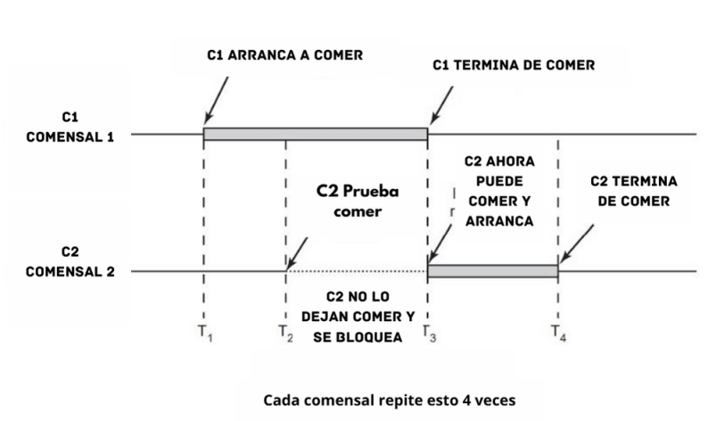

# Práctico 2

# Práctico 3
Punto 1
a) En mi PC, el archivo conhilos.py, que utiliza hilos para ejecutar varias tareas al mismo tiempo, tiene un tiempo promedio de ejecución de 5.12 segundos. Mientras tanto, el archivo sinhilos.py, que no usa hilos y ejecuta cada tarea de manera secuencial, tiene un tiempo promedio de ejecución de 6.32 segundos.

b) No son iguales, ya que el tiempo de ejecución depende de varios factores, como el rendimiento del sistema y la cantidad de tareas en proceso. Incluso en el mismo sistema, al ejecutar varias veces el mismo script, el tiempo puede variar debido a cuestiones internas del sistema, aunque suele acercarse a un valor promedio.

c) Al ejecutar el archivo sin los #, estás permitiendo que los procesos sumador y restador modifiquen la misma variable "acumulador" al mismo tiempo. Esto causa problemas porque ambos procesos intentan acceder a la misma variable simultáneamente. Sin embargo, si las líneas están comentadas, los procesos se ejecutan uno después del otro, evitando este problema.

Punto 2
